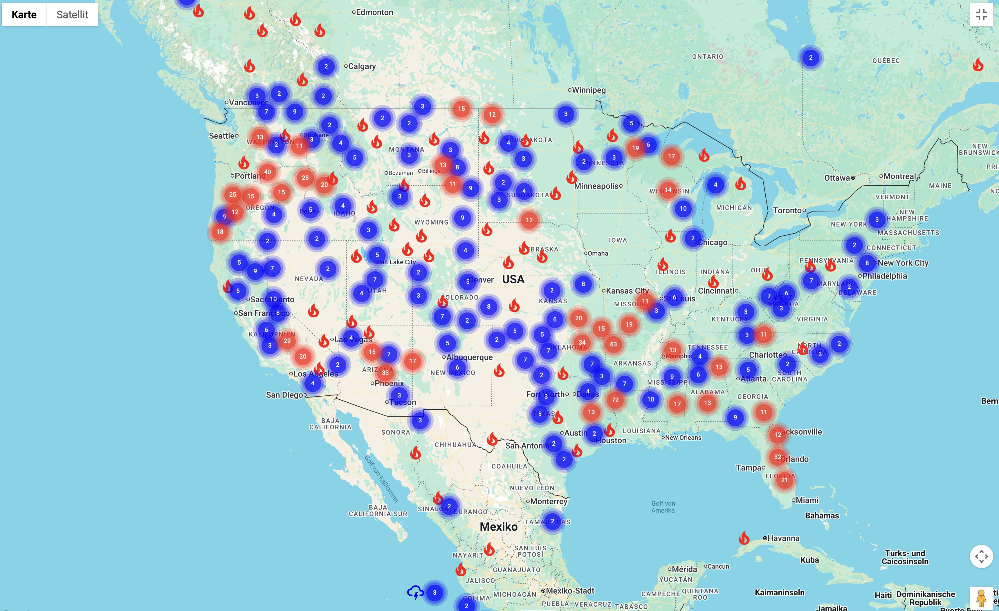

# Natural Event Tracker

This app shows the locations of wildfires and severe storms that are currently active around the world. 



## Usage

Download or clone the repository.

Specify your Google Maps JavaScript API key in the .env file.
Optionally specify a Google Map-ID for a map design in the .env file.

Run the following commands in the root directory:

```bash
npm install
npm run build
npm run preview
```